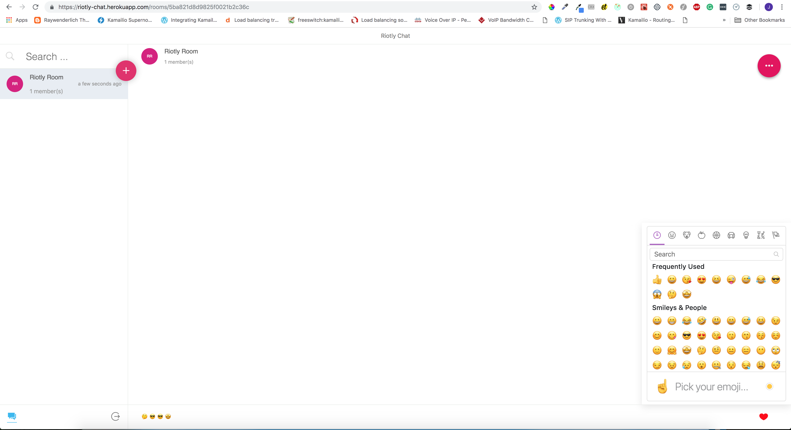

# Riotly Chat Room App

This application was built with Socket.io, MongoDB, Express, Node.js and React.js

## Test URL

- **Backend:** https://riotly-chat-api.herokuapp.com
- **Frontend:** https://riotly-chat.herokuapp.com

# Getting Started

Install yarn:
```js
npm install -g yarn
```

Install dependencies for both the backend and frontend:
```sh
yarn install-all
```

Start server:
```sh
# Start server
yarn riotly-chat-server start

# Start client app
yarn riotly-chat-client start
```

## Docker

#### Using Docker Compose for Development
```sh
# service restarts on file change
docker-compose up --build --abort-on-container-exit
```

#### Building and running without Docker Compose
```bash
# To use this option you need to make sure mongodb is listening on port 27017

# Build riotly server docker
cd ./riotly-chat-server
docker build -t riotly-server .

# Run riotly server docker
docker run -p 8000:8000 riotly-server

# Build riotly client docker
cd ./riotly-chat-client
docker build -t riotly-client .

# Run riotly client docker
docker run -p 3000:3000 riotly-client
```


# Implementation Explanation

## Dependencies
- Front-end: **React, Redux, React-Router, SCSS**
- Asynchronous communication: **axios, socket.io-client**
- Back-end: **Node.js, Express.js, Socket.io**
- Database: **Mongoose, MongoDB**
- Build Tools: **Webpack, Babel, Docker**
- Cloud Platform: **Heroku**
- Third party API: **Google OAUTH**


## Login UI

If the token is undefined, it redirects the user to the login page for authentication using the Google login API


## List Chat Room UI
After authentication, a new user is presented with a blank page with the possibility to create or join chatrooms. Also, existing users get to see rooms they already joined.


## Chat Room UI

This enables the users to send messages, emojis, delete chatroom, view members





# Time Logs

- **Gathered necessary requirements** - 2 hours
- **Designed the Login UI** - 2 hours
- **Implemented the Login Logic (Backend & Frontend)** - 2 hours
- **Designed Chat Room Database** - 2 hours
- **Designed List Chat Rooms UI** -  2 hours
- **Implemented list and search chatrooms logic** - 2 hours
- **Implemented join chatrooms logic** - 2 hours
- **Designed Chat UI** - 4 hours
- **Implemented realtime messaging feature** - 6 hours
- **Implemented logout feature** - 1 hour
- **Created Docker environment for the app** - 2 hours
- **Deployed app to Heroku and final round of test** - 3 hours
